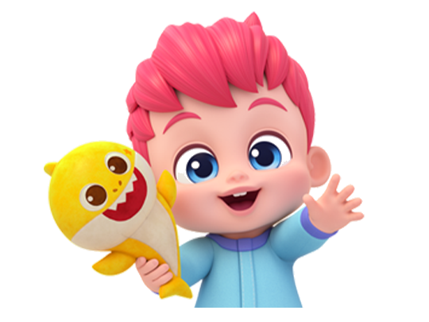

# BebeFinn — Alphabet Adventure 🦈🌊

A bright, toddler-friendly **alphabet, numbers, colors, and animals** game built for kids ages 2–6. Designed to be safe, simple, and joyful — no ads, no purchases, no text input, no fail states. Just tap, listen, learn, and giggle.

> **Live demo:** https://bebefinn-vc-game.vercel.app



---

## ✨ Features

- **A → Z + 1 → 10 lessons** — every letter and number paired with a friendly word, emoji, and spoken pronunciation.
- **10 animated 3D animals** — cat, dog, lion, zebra, elephant, gorilla, fish, jellyfish, turtle, whale — built with Three.js per-animal rigs (head turns, tail wags, ear flaps, blinking eyes, blowhole spouts, segmented elephant trunks, gallop cycles, jellyfish bell pulse).
- **Real CC0 animal sounds** — natural recordings sourced from Wikimedia Commons so kids hear what each animal actually sounds like.
- **Cheerful generated music** — looping background track and interaction SFX synthesized via the Web Audio API.
- **Speech synthesis** — every lesson is read out loud through the browser SpeechSynthesis API.
- **Suspense → reveal flow** — each lesson plays a short anticipation cue before revealing the answer.
- **Toddler-grade UI** — large rounded buttons (≥64 px touch targets), no text inputs, no external links, no in-app purchases, no data collection.
- **Keyboard shortcuts** — `A–Z` jump to a letter, `1–9` to numbers, `0` to ten, `←` / `→` to navigate, `Space` to replay, `Esc` to exit.
- **Mobile-first + responsive** — works on phones, tablets, and desktop.

---

## 🏗 Tech Stack

| Layer | Choice |
|------|--------|
| Framework | [Next.js 15](https://nextjs.org) (App Router) + React 19 + TypeScript (strict) |
| Styling | [Tailwind CSS v4](https://tailwindcss.com) |
| 3D / Animation | [Three.js](https://threejs.org) `requestAnimationFrame` rigs + CSS keyframe overlays |
| UI motion | [Framer Motion](https://www.framer.com/motion/) |
| Audio | Web Audio API (synthesis) + `<audio>` elements (real animal sound files) |
| Speech | Browser `SpeechSynthesis` via `src/hooks/use-speech.ts` |
| Hosting | [Vercel](https://vercel.com) |

---

## 🚀 Getting Started

```bash
# Install
npm install

# Run dev server
npm run dev
# open http://localhost:3000

# Production build
npm run build
npm run start

# Type check
npx tsc --noEmit
```

> ⚠️ **Avoid running `npm run dev` and `npm run build` at the same time** — Next.js writes to `.next/` in both, causing conflicts.

---

## 📁 Project Structure

```
bebefinn-vc-game/
├── AGENTS.md                  # Source of truth for agent instructions
├── CLAUDE.md                  # Pointer to AGENTS.md
├── public/
│   ├── assets/images/         # Character art and placeholders
│   └── sounds/                # CC0 animal sound MP3s
├── src/
│   ├── app/                   # Next.js App Router pages + globals.css
│   ├── components/
│   │   ├── ui/                # Reusable UI (buttons, modals, menus)
│   │   └── game/              # Alphabet game, BebeFinn character, animal stage
│   ├── hooks/                 # use-game-audio, use-speech
│   └── lib/                   # Lesson data, shared utilities
├── next.config.ts
└── tsconfig.json
```

Key files:

- `src/components/game/alphabet-game.tsx` — main game flow (suspense, reveal, navigation).
- `src/components/game/animal-stage.tsx` — Three.js rigs for each animal + CSS animation overlay.
- `src/hooks/use-game-audio.ts` — Web Audio music/SFX, real animal-sound playback, vibrato helper.
- `src/lib/alphabet-data.ts` — lesson content (letter, word, emoji, character, sound mapping).

---

## 🦁 Animal Sounds — Attribution

All animal recordings are sourced from [Wikimedia Commons](https://commons.wikimedia.org) under CC0 / public domain or CC-BY licenses. Files were trimmed, normalized, and converted to mono 96 kbps MP3 with `ffmpeg`.

| Animal | Source File |
|-------|-------------|
| Cat | `Meow.ogg` |
| Dog | `Barking of a dog.ogg` |
| Lion | `Lion raring-sound1TamilNadu178.ogg` |
| Elephant | `Elephant voice - trumpeting.ogg` |
| Zebra | `Grévys zebra (Sound Effects).ogg` |
| Gorilla | `Pant-hoot call made by a male chimpanzee.ogg` (closest available primate) |
| Whale | `Humpback whale moo.ogg` |
| Fish / Jellyfish / Turtle | `Water bubbles chortling.ogg` (these animals are near-silent in nature) |

If you replace the bundled assets with licensed BebeFinn / Pinkfong audio for production, drop them into `public/sounds/<animal>.mp3` — the keys in `ANIMAL_SOUND_FILES` (in `use-game-audio.ts`) drive playback.

---

## 🎨 Design Principles

### Child Safety First
- No external links or ads
- No text input from children
- No in-app purchases
- No analytics / data collection
- All content age-appropriate

### UI/UX for Young Children
- Minimum **64 px** touch targets
- Maximum **2 taps** to reach any game
- No reading required — icons, images, audio
- Positive reinforcement only — no fail states
- Auto-save (kids never manage saves)
- Parent gate planned for settings/exit

### Visual Style
- Saturated BebeFinn palette (ocean blues, coral pinks, sunny yellows)
- Rounded corners everywhere
- Large expressive sprites with looping idle animations
- Underwater-themed backgrounds

### Audio
- Cheerful, looping background music tolerable for parents
- SFX on every interaction (tap, navigate, suspense, reveal, celebration)
- Animal sounds playful but recognizable

---

## 🎮 Gameplay Notes

- Number lessons read as `1 for 1`, `2 for 2`, etc. Don't double the leading number.
- Custom person/family labels in `alphabet-data.ts` should be preserved exactly unless explicitly changed.
- Each lesson follows: **suspense cue → reveal letter → speak word → play animal sound (if applicable) → celebrate**.
- Speech and animal sound run in parallel, gated so they don't talk over each other.

---

## 🛠 Conventions

- TypeScript strict mode — no `any`
- Functional components, named exports
- `kebab-case.tsx` for components, `camelCase.ts` for utilities
- One component per file
- Game logic kept separate from React rendering
- `requestAnimationFrame` (never `setInterval`) for game loops
- Three.js: stable canvas dimensions, dispose geometries/materials/renderers on cleanup
- Don't rely on faint canvas-only visuals for the primary animal — keep the recognizable emoji prominent and high-contrast

For the canonical agent / contributor guide see [`AGENTS.md`](./AGENTS.md).

---

## 🧪 Testing

> Test scripts are not yet wired up. Planned:
> - **Vitest** — game logic, utilities
> - **React Testing Library** — components
> - **Playwright** — critical user flows on real touch devices

`npm run lint` is currently a placeholder; use `npx tsc --noEmit` and `npm run build` until linting is reconfigured.

---

## 🚢 Deployment

Production is hosted on Vercel and auto-deploys on push to `main`:

- **Production URL**: https://bebefinn-vc-game.vercel.app
- **Repository**: https://github.com/hassanabidpk/bebefinn-vc-game

Manual deploy:

```bash
vercel --prod
```

---

## 🗺 Roadmap

- [ ] Parent gate for settings / exit
- [ ] Korean (primary) + English bilingual i18n
- [ ] PWA / offline support so kids can play without Wi-Fi
- [ ] More mini-games: Ocean Adventure, Music & Dance, Puzzle Time, Coloring Book, Memory Match
- [ ] Replace placeholder character art with licensed BebeFinn / Pinkfong assets
- [ ] Lottie or GLTF realistic animal animations (currently stylized procedural Three.js rigs)

---

## 📜 License

Source code: MIT (or update as appropriate).
Animal recordings: CC0 / CC-BY from Wikimedia Commons (see attribution table above).
Character placeholder art belongs to its respective rightsholders and must be replaced before any production / commercial release.

---

Made with 💙 for tiny humans.
